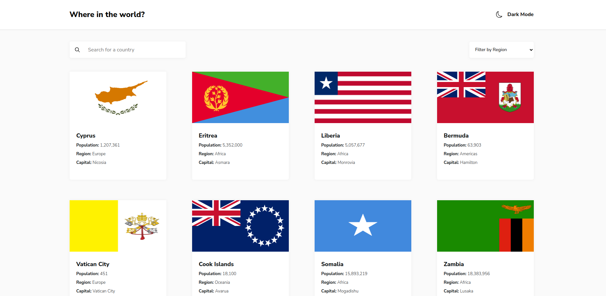

# Countries Application

## Introduction

In this project I used the [countries API](https://restcountries.com) to build an application that fetches the data of over 200 countries and renders it to the screen. 
This project was part of my training in the Azubi Africa Frontend Development program.

The full project can be seen at [this](https://countries-application-one.vercel.app/) link.

