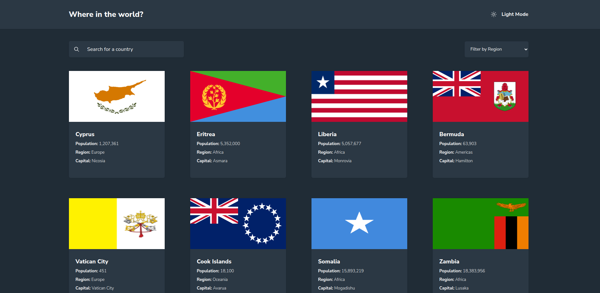
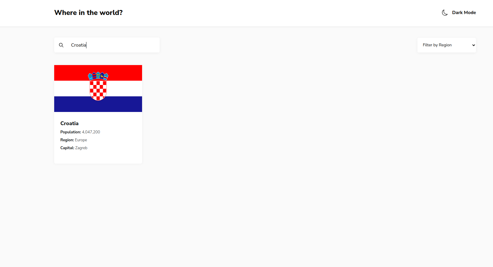
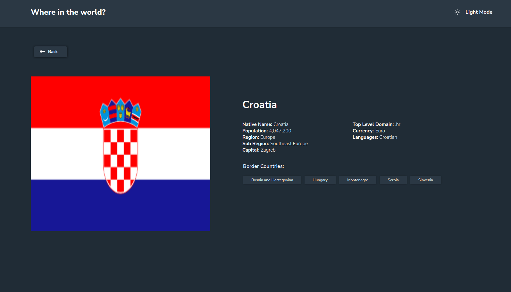
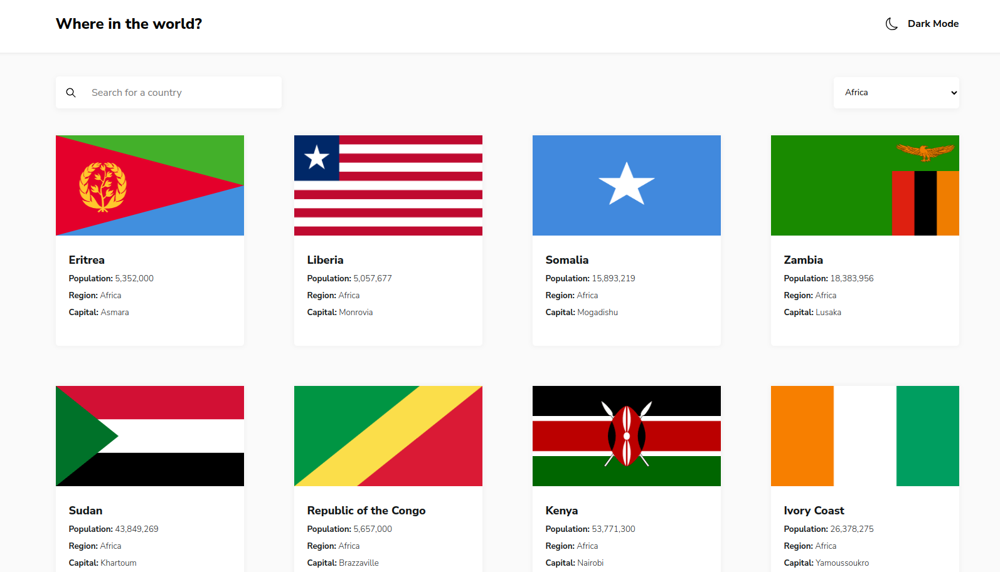

# Countries Application

## Introduction

In this project I used the [countries API](https://restcountries.com) to build an application that fetches the data of over 200 countries and renders them for users. 
This project was part of my training in the Azubi Africa Frontend Development program.

The full project can be seen at [this](https://countries-application-one.vercel.app/) link.

### Technologies used

### Features of the project

1. The application incorporates a switch that allows users to toggle between a light and dark mode. 

2. The application has a search bar that allows users to search for a specific country. Once the user has found a country they can click on the country card to get a more detailed view of the specific country.

3. The application also features a filter that allows users to filter the countries by region.

